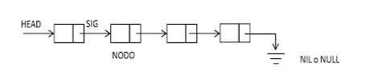

# Listas enlazadas simples



## Declaracion de una lista

```c

typedef struct nodo { //Define un elemento
int info; //Informacion del elemento / Campo de la estructura
char number[10];
struct nodo *sig; //Puntero al siguiente elemento
}Nodo;

typedef nodol *lista //Alias para el tipo de dato nodo

```


# Puntos del Proyecto 

* lista de docentes
* Lista de pacientes
* lista de libros
* lista de productos

## Menu

* Insertar.
* Buscar. (por nombre, por codigo, por apellido...)
* Modificar.
* Eliminar.
* Mostrar/imprimir.
* Salir.

