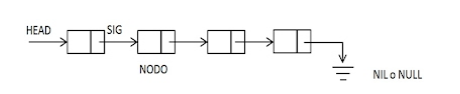
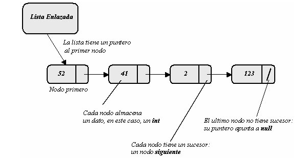

# Listas Con Enlaces Simples

Las listas son estructuras de datos semejantes a los array salvo que el acceso a un elemento no se hace mediante un índice sino mediante un puntero. La asignación de memoria es hecha durante la ejecución. En una lista los elementos son contiguos en lo que concierne al enlazado.




Para definir un elemento de la lista, será utilizado el tipo struct. El elemento de la lista contendrá un campo dato y un puntero siguiente. El puntero siguiente debe ser del mismo tipo que el elemento, si no, no podrá apuntar hacia el elemento. 

***El puntero siguiente permitirá el acceso al próximo elemento. Por ejemplo la declaración puede ser así:***
    
```c

typedef struct nodo { //Define un elemento
int *Dato; 
struct nodo *siguiente; //Puntero al siguiente elemento
}lista;

```



# Insercion De Un Elemento En Una Lista

**A continuación se presenta un algoritmo  de inserción y registro de los elementos:**

* Declaración del elemento a insertar
* Asignación de la memoria para el nuevo elemento
* Rellenar el contenido del campo de datos
* Actualizar los punteros hacia el primer y último elemento si es necesario.
* Caso particular: en una lista con un solo elemento, el primero es al mismo tiempo el último.
* Actualizar el tamaño de la lista

**Para añadir un elemento a la lista hay varios casos:**
1.	Inserción en una lista vacía
2.	Inserción al inicio de la lista
3.	Inserción al final de la lista
4.	Inserción en otra parte de la lista.

## Inserción en una lista vacía

**Ejemplo de la funcion:**
    
    ```c
    int ins_en_lista_vacia(Lista *lista, char *dato);
    ```
**La función devuelve 1 en caso de error, si no devuelve 0. Etapas:**
* Asignación de memoria para el nuevo elemento
* Rellenar el campo de datos del nuevo elemento
* El puntero siguiente del nuevo elemento apuntará hacia NULL (ya que la inserción es hecha en una lista vacía se utiliza la dirección del puntero inicio que vale NULL)
* Los punteros inicio y fin apuntaran hacia el nuevo elemento
* El tamaño es actualizado

## Inserción al inicio de la lista

**Ejemplo de la funcion:**
    
    ```c
    int ins_al_inicio(Lista *lista, char *dato);
    ```
**La función devuelve -1 en caso de error, si no devuelve 0. Etapas:**
* Asignación de memoria al nuevo elemento
* Rellenar el campo de datos del nuevo elemento
* El puntero siguiente del nuevo elemento apunta hacia el primer elemento
* El puntero inicio apunta hacia el nuevo elemento
* El puntero fin no cambia
* El tamaño es incrementado

## Inserción al final de la lista

**Ejemplo de la funcion:**
    
    ```c
    int ins_al_final(Lista *lista, Element *actual,char *dato);
    ```
**La función devuelve -1 en caso de error, si no devuelve 0. Etapas:**
* Asignación de memoria al nuevo elemento
* Rellenar el campo de datos del nuevo elemento
* El puntero siguiente del ultimo elemento apunta hacia el nuevo elemento
* El puntero fin apunta hacia el nuevo elemento
* El puntero inicio no cambia
* El tamaño es incrementado

## Inserción en otra parte de la lista

**Ejemplo de la funcion:**
    
    ```c
    int ins_en_otra_parte(Lista *lista,char *dato, int pos);
    ```
**La función devuelve -1 en caso de error, si no devuelve 0. La inserción se efectuará después de haber pasado a la función una posición como argumento. Si la posición indicada no tiene que ser el último elemento. En ese caso hay que utilizar la función de inserción al final de la lista. Etapas:**
* Asignación de memoria al nuevo elemento
* Rellenar el campo de datos del nuevo elemento
* Elegir una posición en la lista (la inserción se hará después de haber elegido la posición)
* El puntero siguiente del nuevo elemento apunta hacia la dirección a la que apunta el puntero siguiente del elemento actual.
* El puntero siguiente del elemento actual apunta al nuevo elemento
* Los punteros inicio y fin no cambian
* El tamaño se incrementa en una unidad

# Eliminación De Un Elemento De Una Lista

**A continuación un algoritmo para eliminar un elemento de la lista:**
* Uso de un puntero temporal para guardar la dirección de los elementos a eliminar
* el elemento a eliminar se encuentra después del elemento actual
Apuntar el puntero siguiente del elemento actual hacia la dirección del puntero siguiente del elemento a eliminar
* Liberar la memoria ocupada por el elemento eliminado
* Actualizar el tamaño de la lista
* 
**Para eliminar un elemento de la lista hay varios casos:**
1. Eliminación al inicio de la lista
2. Eliminación en otra parte de la lista

## Eliminación al inicio de la lista

**Ejemplo de la funcion:**
    
    ```c
    int sup_inicio(Lista *lista);
    ```

**La función devuelve -1 en caso de error, si no devuelve 0. Etapas:**
* El puntero sup_elem contendrá la dirección del 1er elemento
* El puntero inicio apuntara hacia el 2do elemento
* El tamaño de la lista disminuirá un elemento

## Eliminación en otra parte de la lista

**Ejemplo de la funcion:**
    
    ```c
    int sup_en_lista(Lista *lista, int pos);
    ```
**La función devuelve -1 en caso de error, si no devuelve 0. Etapas:**
* El puntero sup_elem contendrá la dirección hacia la que apunta el puntero siguiente del elemento actual
* El puntero siguiente del elemento actual apuntara hacia el elemento al que apunta el puntero siguiente del elemento que sigue al elemento actual en la lista.
* Si el elemento actual es el penúltimo elemento, el puntero fin debe ser actualizado.
* el tamaño de la lista será disminuido en un elemento

# Visualizacion de la lista

Para mostrar la lista entera hay que posicionarse al inicio de la lista (el puntero inicio lo permitirá). Luego utilizando el puntero siguiente de cada elemento la lista es recorrida del 1ero al ultimo elemento. La condición para detener es dada por el puntero siguiente del ultimo elemento que vale NULL. La función

```c

/* visualización de la lista */
void visualización (Lista * lista){
    Element *actual;
    actual = lista->inicio;

    while (actual != NULL){
        printf ("%p – %sn", actual, actual->dato);
        actual = actual->siguiente;
    }
}

```

# Ejemplo

```c

#include <stdio.h>
#include <stdlib.h>
#include <conio.h>

typedef struct nodo
{
	int info;
	struct nodo *sig;
} nodoL;

// Alias para lista
typedef nodoL* lista;

void insinicio(lista *L, int n);/* inserta el valor n al frente de la lista */
int imprimir(nodoL* L);/* muestra por pantalla los valores de L, en forma recursiva */
void eliminar(lista *L, int n);/*borra un elemento de la lista*/

int main()
{
	//Se declara y asigna una la variable seleccionar una opción en el menú.
	int op=-1;
	//Se declara una lista.
	lista nlista=NULL;
	//Mientras op se distinto de 0 (Cuando es op=0 finaliza el programa.
	while(op)
	{
		system("cls"); //Borrar la pantalla.
		//Mostrar en pantalla las opciones del menú.
		printf("\t\tEjemplo  sencillo de Listas (Enlace simple) \n\n\tSeleccione una opcion\n\n\t 1. Agregar elemento al inicio\n\t 2. Imprimir lista\n\t 3. Eliminar un elemento\n\t 0. Salir\n");
		scanf("%d",&op); //Captura el numero opción seleccionada.
		switch(op) //Ir a la opción indicada por el usuario.
		{
			//Ingresar un valor al comienzo de la lista.
		case 1:
		{
			int valor;//Crear una variable para el numero a insertar en la lista.
			system("cls");//Borrar la pantalla.
			printf("Ingrese el numero para agregar a la lista:\n");//Pedir por pantalla un numero para insertar en la lista.
			scanf("%d",&valor);//Capturar el número a insertar en la lista.
			system("cls");//Borrar la pantalla.
			insinicio(&nlista,valor);//LLama al procedimiento que inserta un numero al comienzo de la lista.
			getch(); //Esperar que el usuario presione una tecla.
			break;
		}
		//Mostrar la lista por pantalla.
		case 2:
		{
			system("cls");//Borrar la pantalla.
			//Mostrar en pantalla un titulo.
			printf("Los numeros cargados en la lista:\n\n");
			//Declarar un variable y asignarle el valor devuelto por la función  mostrar (0 Lista vacía 1Lista no vacía).
			int i = imprimir(nlista);
			//Chequear si la lista esta vacía y mostrar en pantalla el texto que corresponda.
			if(i==0)printf("La lista esta vacia \n\n");
			else printf("NULL \n\n");
			//Esperar que el usuario presione una tecla.
			getch();
			break;
		}
		//Eliminar un número de la lista.
		case 3:
		{
			int n; //Crear un variable que almacene el número a borrar de la lista.
			system("cls");//Borrar la pantalla.
			printf("Ingrese el numero para borrar de la lista:\n"); //Pedir por pantalla un nuúmero para borrar de la lista.
			scanf("%d",&n); //Capturar el número a borrar de la lista.
			system("cls");//Borrar la pantalla.
			eliminar(&nlista,n); //LLamar a la función borrar.
			getch(); //Esperar que el usuario presione una tecla.
			break;
		}
		}
	}
	return 0;
}


```